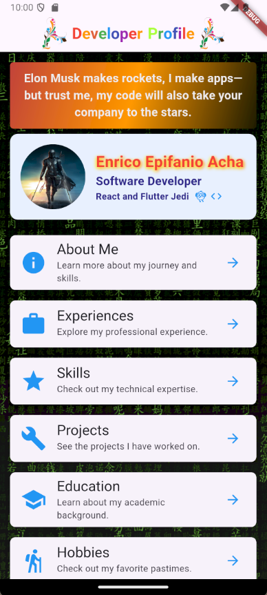
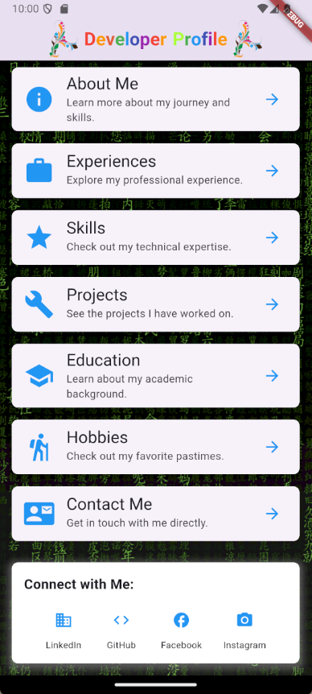
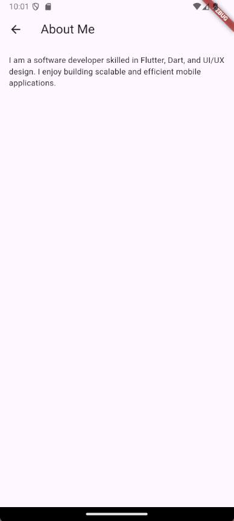
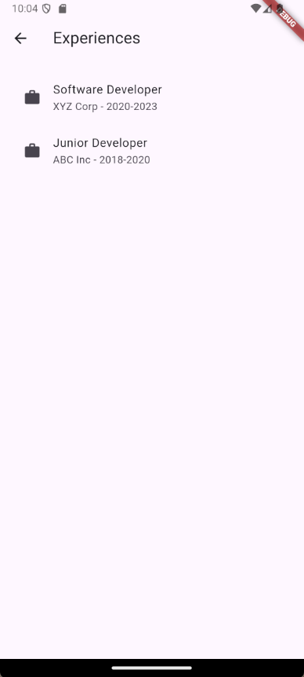
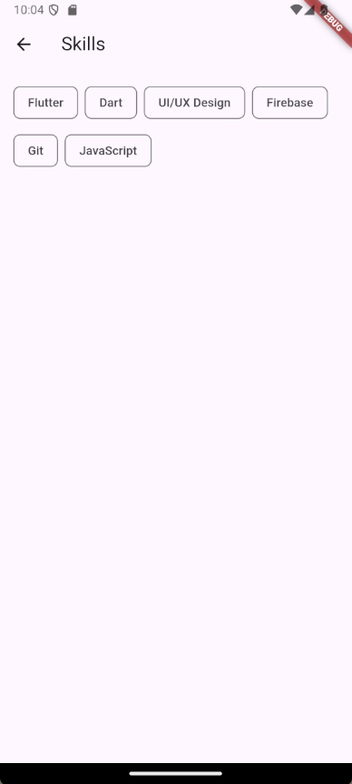
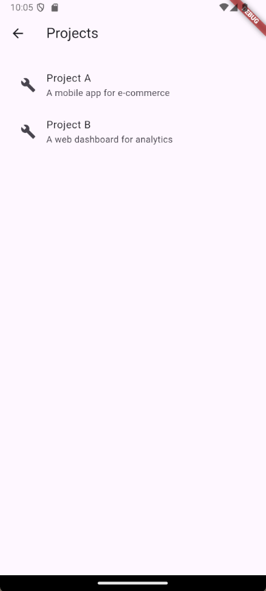
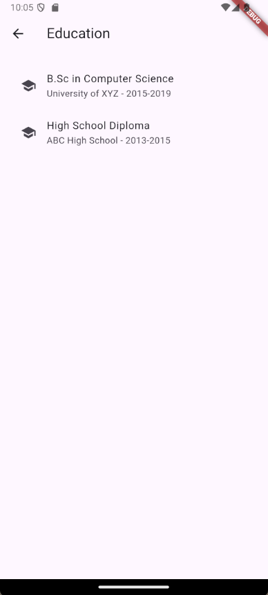
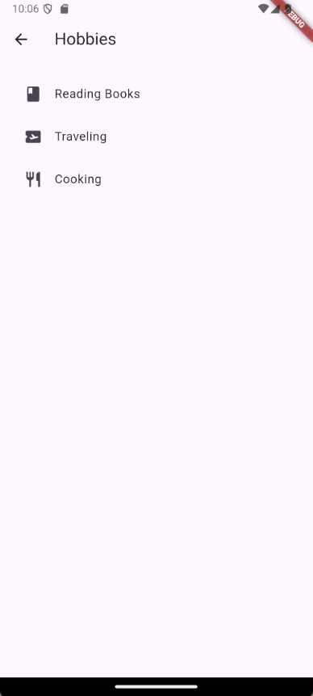
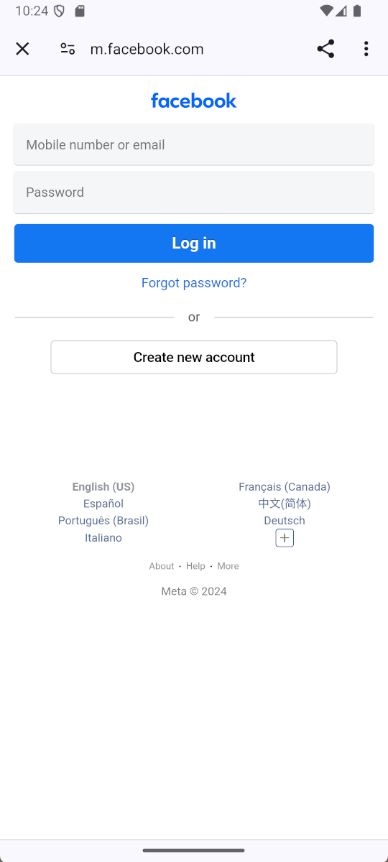

### Filename: 'dev_profile_layout_v1'

# My Developer Profile Layout

## Home page 1

## Home page 2

## About Me page

## Experiences page

## Skills page

## Projects page

## Education page

## Hobbies page

## Contact Me Page

## LinkedIn link page

## Github link page

## Facebook Social Link page

## Instagram Social Link page
